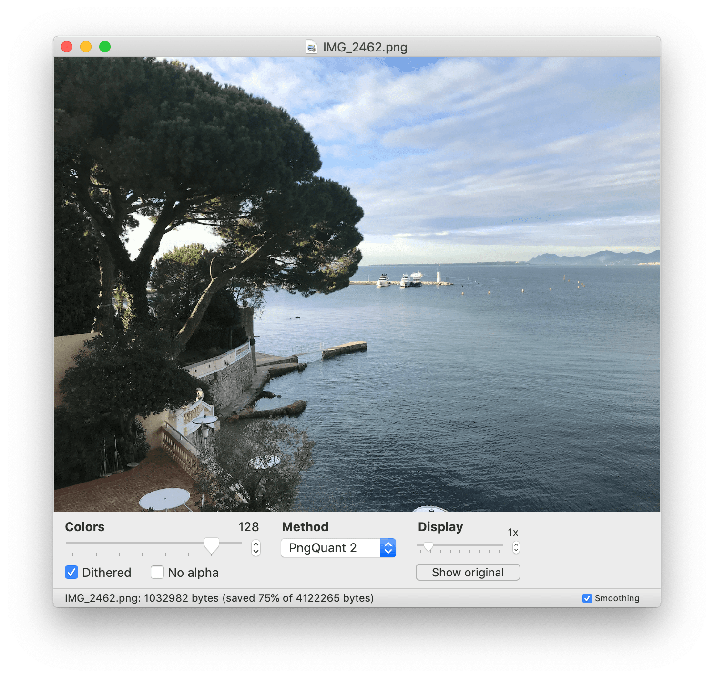
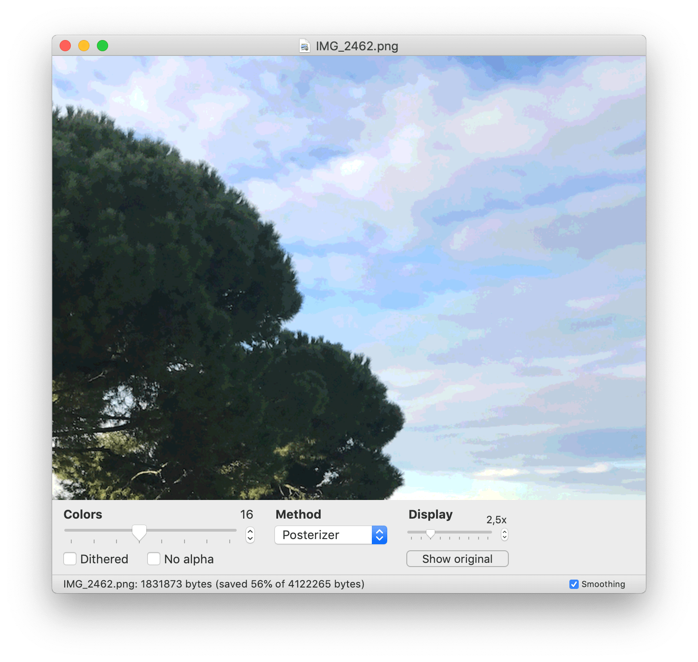
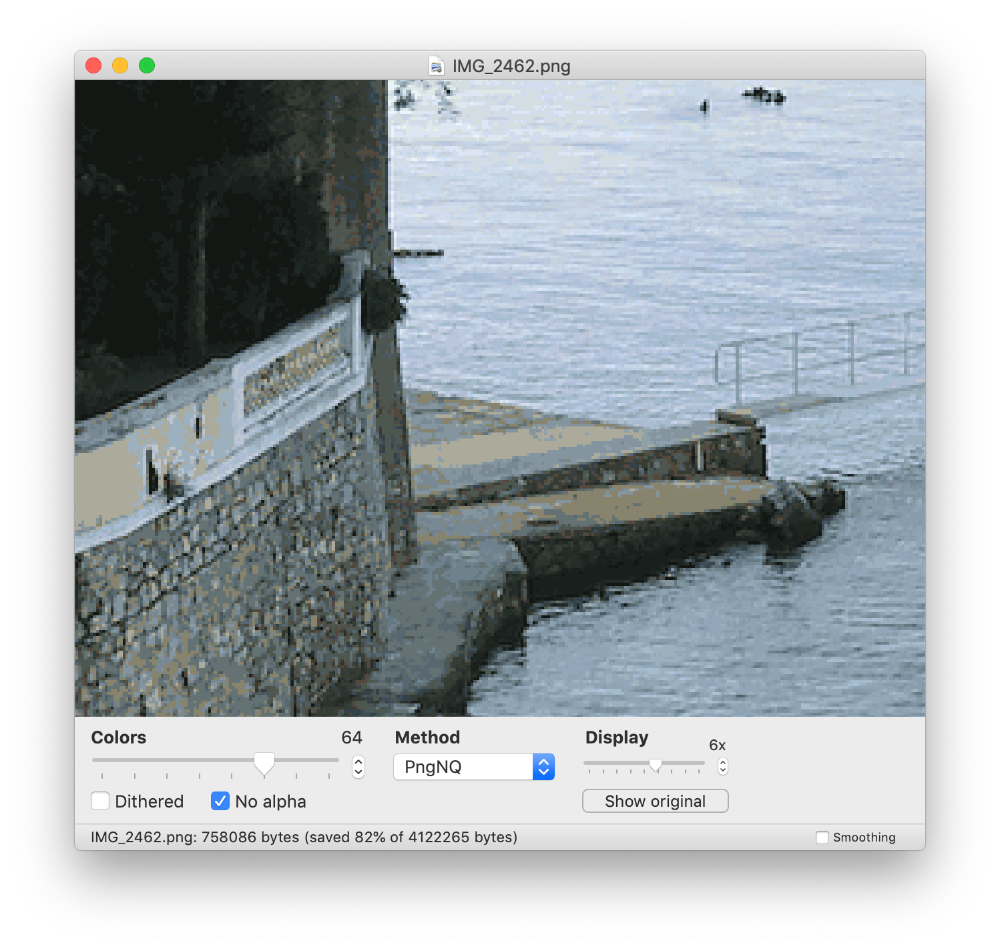

#  The Quantizer 

The Quantizer is a PNG-quantization app strongly inspired by [ImageAlpha](https://pngmini.com).
It uses the same existing algorithms: [PngQuant](https://pngquant.org/lib/), [Posterizer](https://github.com/kornelski/mediancut-posterizer) and [pngnq](http://pngnq.sourceforge.net) to transform any PNG into a 8-bit palettized image. This is an efficient way of generating a lighter image file while preserving perceptual quality.

### Features

* Three quantization algorithms.
* Custom number of colors in the palette.
* Support for dithering.
* Support removing the alpha channel of an image.
* Compare the size of your image before and after.
* Zoom and pan the generated image, compare it with the source, toggle smooth interpolation when zooming.

The existing algorithms, implemented in C, are compiled as static libraries and included in the Swift application. Please see the `LICENSE_EXTERNAL.md` file for their respective licenses.

### Future features

* Improve zooming and panning (center zoom, etc.).
* Add support for Imageoptim.
* Support opening images of any type.

